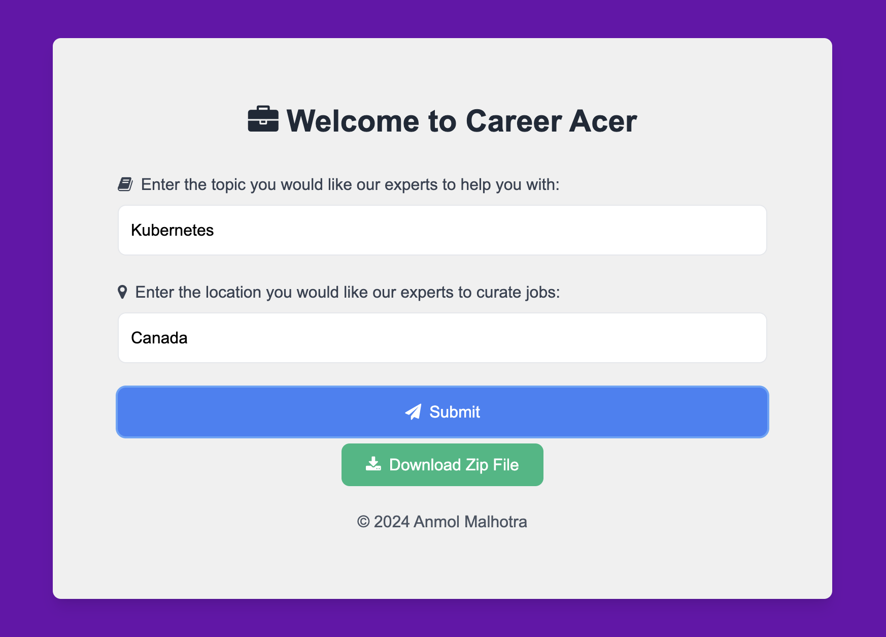

# Career Acer
Career Acer is a comprehensive interview preparation tool designed to help users excel in their job interviews. With Career Acer, users can easily access a wealth of resources tailored to their chosen topic, including job postings, blog posts, YouTube videos, and multiple-choice questions (MCQs).

## Features
- **Job Postings:** Curated job listings to match your desired topic and location.
- **Blog Posts:** Relevant blog articles to enhance your knowledge and skills.
- **YouTube Videos:** Handpicked YouTube videos to provide visual learning and tutorials.
- **MCQ Questions:** Practice with multiple-choice questions to test your understanding and readiness, with questions ranging from Easy to Extreme levels of difficulty.

## How It Works

1. **Select Your Topic:** Choose the subject you want to prepare for.
2. **Choose Your Location:** Specify the location for job postings.
3. **Receive Curated Content:** Get personalized job listings, blog articles, YouTube videos, and MCQs.
4. **Download and Prepare:** Download the content as a ZIP file for offline access and comprehensive preparation.

## Technology Stack
- **Backend:** Flask, Python
- **Frontend:** HTML, Tailwind CSS, JavaScript
- **AI:** - CrewAI, Langchain, RAGs, CrewAI Tools, LLMs (OpenAI, Ollama - llama3)

## AI Integration
The entire project has been created using AI Agents and tasks through CrewAi and its tools. It also enhances data collection using CrewAi tools such as:
- **Google Serper Search**
- **Browserbase Web Loader**
- **Scrape Website**

**RAGs is used to connect LLMs such as OpenAI and Llama3 using Ollama to make the application cost-efficient and easy to use.**

## Overview
The application mainly consists of 4 scripts

**1.Agents.py**

An agent/agents are an autonomous unit designed to perform tasks, make decisions, and communicate with other agents. Similar to a team member with specific skills.
At Career-Acer, agents have roles such as 'Senior Technical Engineer', 'Recruitment Manager', or 'Topic-Tag Expert', 'Blog Writer & Researcher' and 'Popular Tech. Youtuber', each contributing to the Application's overall objective to make a job-seeker's life easy.

**2.Tasks.py**

Tasks are specific assignments for agents, providing detailed instructions including descriptions, responsible agents, required tools, and more, enabling execution of complex actions.
At Career-Acer, the tasks are 'searchYoutube', 'getTopicTags', 'searchBlogs', 'createMCQs' and 'searchJobs'

**3.App.py**

The following code combines user input through a locally-hosted webapp, the Agents and Tasks to connect each Agent to their respective Task, followed by kickoff() to begin the process of data curation and integration according to the job-seeker's preferred topic and location of choice.

**Index.html**
Supports the front-end of Career-Acer made using HTML, Tailwind CSS, JavaScript.

## Setup
To get started, clone the repository and follow the instructions below

```bash
# Clone the repository
git clone https://github.com/anmol1810rs/Career-Acer.git

# Navigate into the project directory
cd Career-Acer

# Create a virtual environment and activate it (optional)
python -m venv venv
source venv/bin/activate

# Download the dependencies as mentioned in the requirements.txt file
pip install -r requirements.txt

# Replace the API Keys in the .env file with your API keys to run the OpenAI LLM Model and Serper Search
LANGCHAIN_API_KEY = "YOUR_LANGCHAIN_API_KEY"
OPENAI_API_KEY = "YOUR_OPENAI_API_KEY"
SERPER_API_KEY = "YOUR_SERPER_API_KEY"

# Incase you plan to run open-source (Ollama - llama3), un-comment the following code in agents.py file
self.llm = Ollama(model = 'llama3')

# Finally, run the application on your localhost
python app.py
```
- **Note: llama3 model would only work if you have Ollama already installed.**
- **To download open-source Ollama models, please check out https://ollama.com/ for more details**

**Note:**
Open-Source models may not give the best results based on multiple experiments carried out**

## Check Results

**Enter details in the UI below**


**Note:**
Once submitted, it takes a few minutes for the Agents to curate the best possible data for you

**------------ PATIENCE IS KEY ------------**

**Downlaod the report.zip folder containing your curated data by clicking the Downlaod icon**


## Results
The sample results for the Kubernetes examples shown above can be found in the *sample_result/result* directory of the repository.
